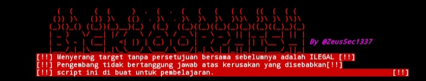

# BackdoorPhishing



Alat Rekayasa Sosial [*Pembuat Pintu Belakang Shell Terbalik untuk Windows/Android*] dengan Ngrok. 
## Fasilitas Jalankan sebagai root: 
```bash git clone https://github.com/ZeusSec1337/backdoorPhishing cd backdoorPhishing; chmod +x backdoorPhishing.sh ``` 
Saat menjalankannya, ia akan secara otomatis menginstal dependensi untuk eksekusi yang benar. 

## Menggunakan
```bash ./backdoorPhishing.sh ``bash ./backdoorPhishing.sh --update ``` 
## Catatan hukum 
Menggunakan BackdoorPhish untuk menyerang target tanpa persetujuan bersama sebelumnya adalah ilegal. 
Pengguna  bertanggung jawab untuk mematuhi semua hukum lokal, negara bagian, dan federal yang berlaku. Pengembang tidak bertanggung jawab dan tidak bertanggung jawab atas penyalahgunaan atau kerusakan yang disebabkan oleh program ini. 

**Penggunaan secara eksklusif untuk tujuan pendidikan dan untuk membuat pengguna sadar.**